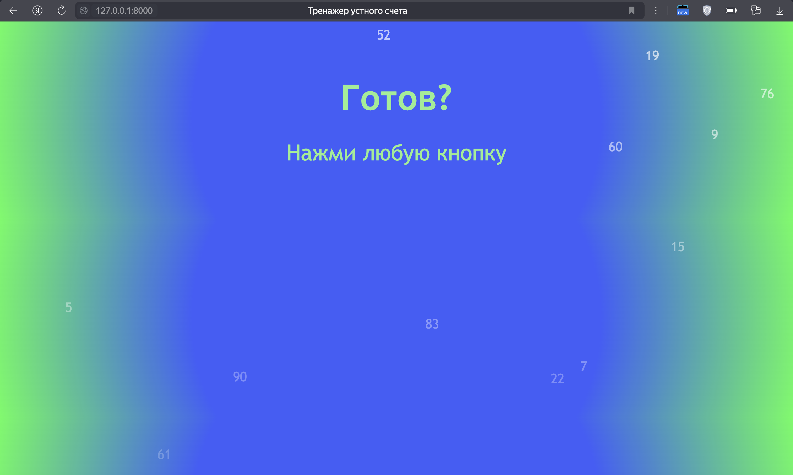
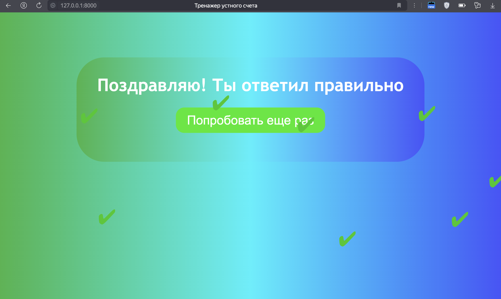

# Oral-Calculation-Trainer
От идеи - до реализации, Django проект

## Описание для пользователя
1) Тренажер устного счета, это веб-приложение,  
которое предназначено для удобной и эффективной  
прокачки устного счета.  

2) Чем это достигается?  
- Регулировкой входных данных: Можно начать с малого  
потом постепенно увеличивать числа и уменшать время.  
- Также можно нацелиться на быстроту счета или счету больших чисел.  
- Простой интерфейс, в котором помещается все,  
чтобы совершенствовать устный счет.  

3) Дальнейшие развитие проекта  
- Этот проект легко маштабировать, в дальнейшем  
планируется добавления статики и регистрации.  
Игровые режимы, таблица лидеров, уровни и др.  

## Описание для разработчиков/HR
- Работа с методами, формами (собирать и обрабатывать входную информацию),    
построение ссыланий на .html файлы, .css стили, работы с Django и логикой реализации  
- Также написаны скрипты на javascript, но большинство кода скопированно,  
Сейчас я изучаю javascript и в скором времени перепишу их сам

## Как запустить
- git clone url repository
- pip install django requests
- cd Upgrade_arithmetic
- python manage.py runserver (and click to url (ip-adress))

## Стэк
-   
-   
-   
-   
- 

## Скрины
  
   
  
  
   
  
  
  
